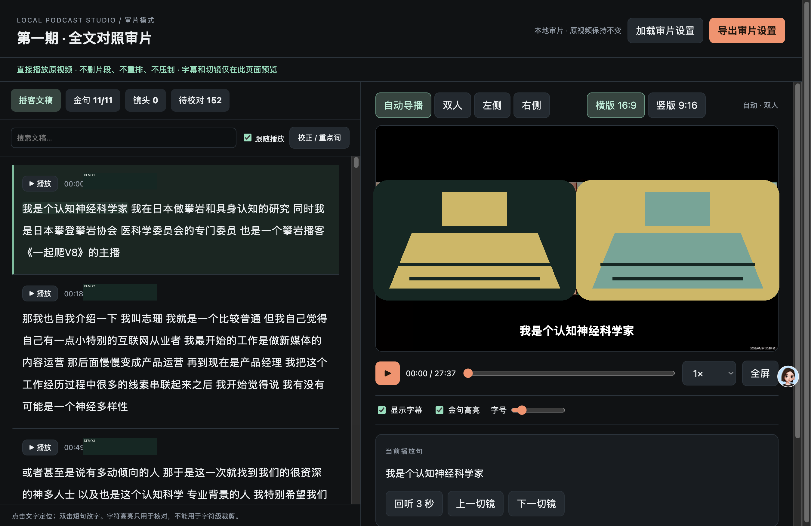

# Podcast Review Workflow

一个面向播客/访谈视频的本地、非破坏性审片 skill：先把原视频、带时间戳文稿、金句、重点词和保守镜头建议组织成可复核的浏览器页面，再由人确认；只有明确要求时才生成横版/竖版样片或输出。

它解决的是“审片与交接”，不是替代剪映、CapCut、Premiere 等 NLE。页面不会默认删除内容、重排素材或把字符级时间戳当成剪口。

## 能力示例

以下截图来自真实工作流，但已用大面积抽象人物覆盖做公开发布脱敏；字幕、横竖版构图和双人/单人布局仍保留，用于展示能力而非展示人物。



## Skill 内容

`skills/podcast-review-workflow/` 是可迁移的核心包，包含：

- `SKILL.md`：触发条件、硬边界和端到端流程；
- `README.md`：兼容性门槛、依赖探测、使用方法、风险与发布前阻断清单；
- `assets/review-template/`：通用审片页面模板，支持文稿播放、高亮、校正、金句、重点词、镜头计划、横竖版预览和审片设置导入/导出；
- `scripts/`：页面构建、本地 Range HTTP 服务、依赖探测、设置校验、按需渲染和 skill 打包；
- `references/`：数据契约、LLM 后处理审计协议和验收清单。

## 快速开始

先读取 `skills/podcast-review-workflow/SKILL.md`，然后准备同一源视频对应的四类输入：

```text
source.mov
words.corrected.words.json
finish.plan.json
finish.analysis.json
```

生成审片页：

```bash
python3 skills/podcast-review-workflow/scripts/check_dependencies.py --mode build-review

python3 skills/podcast-review-workflow/scripts/build_review.py \
  --serve-root /path/to/project \
  --output /path/to/project/review \
  --source /path/to/project/source.mov \
  --words /path/to/project/words.corrected.words.json \
  --plan /path/to/project/finish.plan.json \
  --analysis /path/to/project/finish.analysis.json \
  --title '播客审片'

python3 skills/podcast-review-workflow/scripts/serve_review.py \
  --root /path/to/project --port 8766
```

使用 `http://127.0.0.1:8766/review/` 打开，不要用 `file://`。先导出并校验 review settings，再按“prepare → 短样片 → 人工检查 → 全量输出”的顺序压制。

打包 skill：

```bash
python3 skills/podcast-review-workflow/scripts/package_skill.py \
  skills/podcast-review-workflow \
  --output dist/podcast-review-workflow.zip
```

## 关键边界

- 字符/token 时间只用于播放高亮、定位和字幕分页，不能生成剪口。
- `cuts` 在审片 settings 中必须保持空数组；如需整句删减，也必须用户明确授权并在 NLE 中二次检查。
- raw ASR 不覆盖；文本校正、金句和重点词必须有独立的派生数据或审计记录。
- 不确定说话人时回到双人画面；音频 RMS 只能作为 speech/pause gate，不能单独证明说话人。
- 横版和竖版都先做短样片；浏览器预览不等于最终编码结果。

详细规则见 [`skills/podcast-review-workflow/SKILL.md`](skills/podcast-review-workflow/SKILL.md)。
